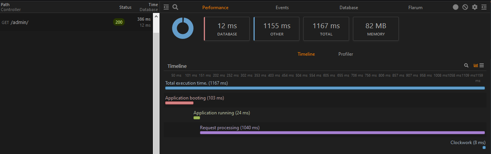

# FriendsOfFlarum Clockwork

 [](https://packagist.org/packages/fof/clockwork) [](https://opencollective.com/fof/donate)

A [Flarum](http://flarum.org) extension that integrates [Clockwork](https://underground.works/clockwork/) — a developer tools panel for inspecting and profiling requests in real time.



---

## What it does

Once installed and enabled, every HTTP request to your Flarum forum is profiled and stored. You can inspect them using the [Clockwork browser extension](https://underground.works/clockwork/#how-to-use) (available for Chrome and Firefox) or by visiting `/__clockwork` in your browser.

### Performance tab

- **Timeline** — visualises application boot, request processing, controller logic, and data serialisation broken down by phase.
- **Memory usage** — peak memory consumed per request.

### Database tab

- All SQL queries executed during the request, with bindings, duration, and a stack trace showing where each query originated.

### Cache tab

- Cache hits, misses, writes, and deletes, with keys and values.

### Queue tab

- Jobs dispatched during the request, showing job class, queue name, dispatch time, payload, and stack trace.
- When using a real queue driver (Redis, database), each processed job appears as a separate entry with its own timeline, queries, cache operations, and logs — linked back to the HTTP request that dispatched it.

### Redis tab

- All Redis commands executed during the request or queue job, with parameters, duration, and connection name. Requires [fof/redis](https://github.com/FriendsOfFlarum/redis) to be installed and active.

### Events tab

- Flarum and Laravel events fired during the request, with counts.

### Flarum tab

- Installed and enabled extension counts.
- Core version information (Flarum, PHP, MySQL).
- Full extension list with enabled/disabled status.
- Frontend document payload (layout view, app view, page payload) for forum and admin page requests.

---

## Installation

```sh
composer require fof/clockwork:"*"
```

Enable the extension in your Flarum admin panel. Access is restricted to forum administrators.

---

## Updating

```sh
composer update fof/clockwork
php flarum cache:clear
```

---

## Nginx configuration

If you are using the `.nginx.conf` file included with Flarum, add the following **above** the `location /` block to allow Clockwork's assets and data to be served correctly:

```nginx
location ~* /__clockwork/.*\.(css|js|json|png|jpg) {
    try_files /index.php?$query_string /index.php?$query_string;
}
```

---

## Browser extension

Install the Clockwork browser extension to view profiling data directly in your browser's developer tools:

- [Chrome](https://chrome.google.com/webstore/detail/clockwork/dmggabnehkmmfmdffgajcflpdjlnoemp)
- [Firefox](https://addons.mozilla.org/en-US/firefox/addon/clockwork-dev-tools/)

Alternatively, visit `https://your-forum.com/__clockwork` to access the built-in web UI without the extension.

---

## Links

[](https://opencollective.com/fof/donate)

- [Packagist](https://packagist.org/packages/fof/clockwork)
- [GitHub](https://github.com/FriendsOfFlarum/clockwork)
- [Clockwork](https://underground.works/clockwork/)

An extension by [FriendsOfFlarum](https://github.com/FriendsOfFlarum).
